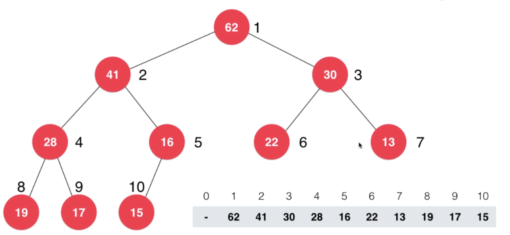
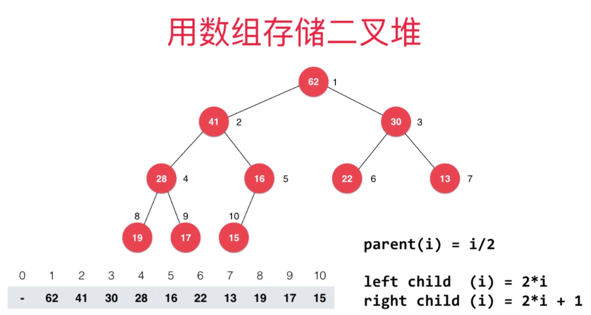
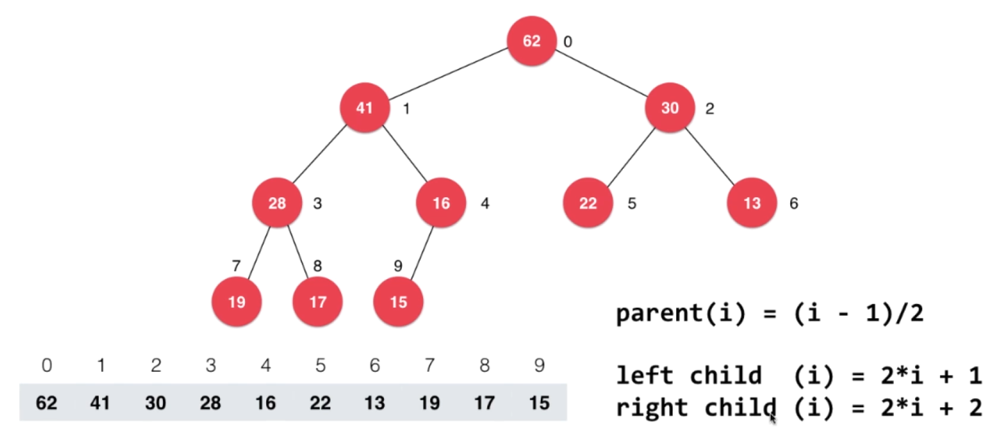
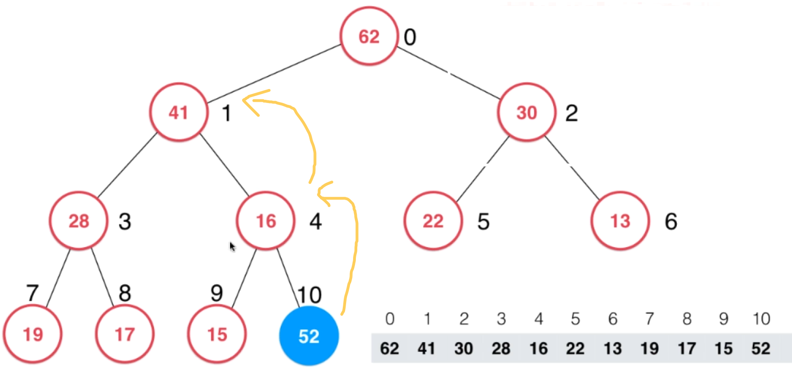
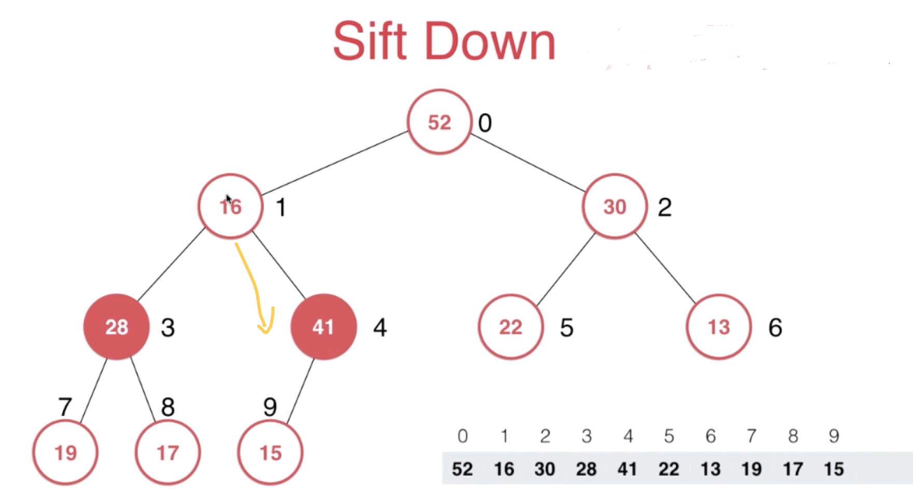
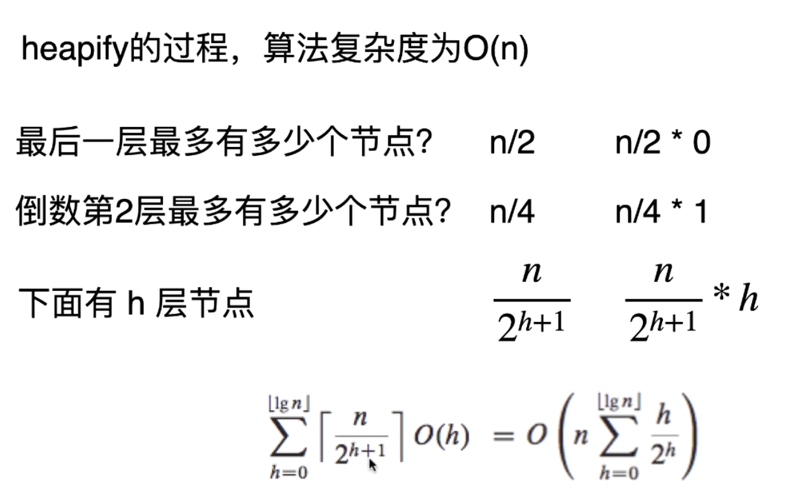

# 堆和优先队列

## 什么是优先队列

普通队列：先进先出，后进后出

优先队列：出队顺序和入队顺序无关，和优先级有关。

比如任务处理中心，每次处理优先级最高的任务，在这里它不能排序后依次执行，因为它是动态的，随时会有新的任务进来。所以需要使用优先队列。

又或者是游戏中，去攻击周围的敌人，敌人是动态变化的。而且实际需要攻击优先级最高的敌人(如血最少，或脆弱的法式等)。

```ts
interface Queue<E> {
    void enqueue(E)
    E dequeue() // 出队(优先级最高的元素)
    E getFront() // 队首
    int getSize()
    boolean isEmpty()
}
```

## 底层实现

| 数据结构     | 入队    | 出队(拿出最大元素) | 说明                                         |
| ------------ | ------- | ------------------ | -------------------------------------------- |
| 普通线性结构 | O(1)    | O(n)               | 出队时需要扫描找到最大的值                   |
| 顺序线性结构 | O(n)    | O(1)               | 一直维持顺序的队列，入队时需要插入到合适位置 |
| 堆           | O(logn) | O(logn)            |                                              |

## 堆

### 什么是堆

堆是一棵树。常用的是二叉堆(Binary Heap)。



**二叉堆性质**

- 二叉堆是一颗完全二叉树。
- 二叉堆中某个节点的值总是不大于其父节点的值(最大堆，堆顶值最大，相对应的是最小堆)

### 二叉堆存储

- 链表
- 数组
  - 好处: 父子元素有逻辑关系
  - 将 0 空出来，方便计算




### 向堆中添加元素(Sift Up)

1. 将元素 A 插入到数组中
2. 将元素 A 与它的父节点比较，并交换位置，保证父节点值大于等于子节点值



### 从堆中取出元素(Sift Down)

1. 将堆顶元素取出，并且将数组中最后一个元素放到堆顶
2. 将堆顶元素往下调，与较大子元素比较并换位。保证堆的性质，父元素大于子元素



### 堆排序

### Heapify  和 replace

- replace 取出最大元素后，放入一个新元素
  - 实现：可以先 extractMax, 再 add，两次 O(logn) 的操作
  - 实现：可以将堆顶元素替换后，执行 Sift Down，一次 O(logn) 操作
- heapify: 将任意数组整理成堆的形状
  - 依次 add ，是 O(nlogn) 时间复杂度，相比 heaify 的 O(n) 慢了
  - 实现：从最后一个非叶子节点开始，往前进行执行 Sift Down
  - 最后一个非叶子节点的索引：也就是最后一个节点的父节点的索引


### Heapify 算法复杂度

满二叉树节点个数：


非叶子节点和叶子节点树差不多。大约是 n / 2 个。



